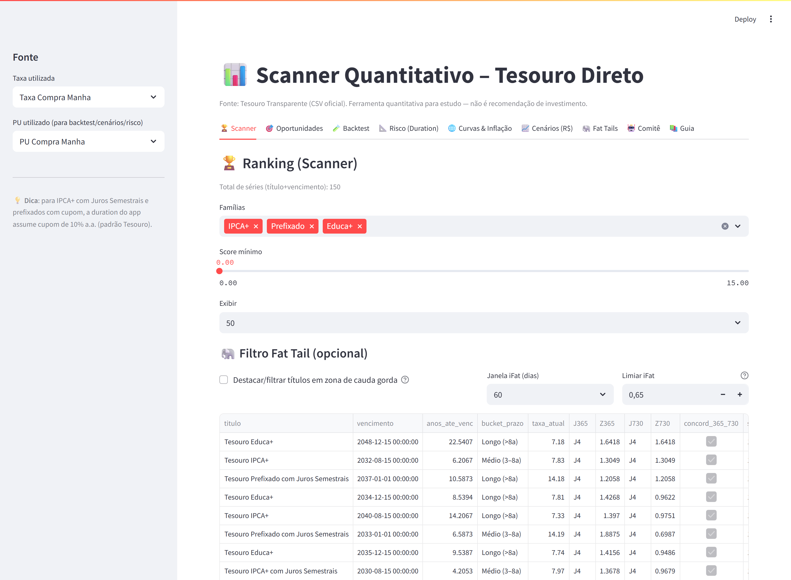
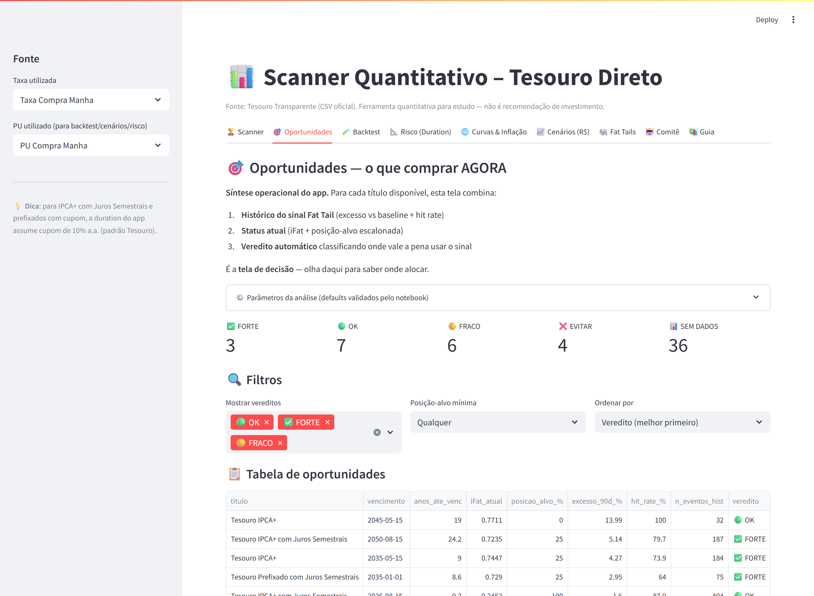
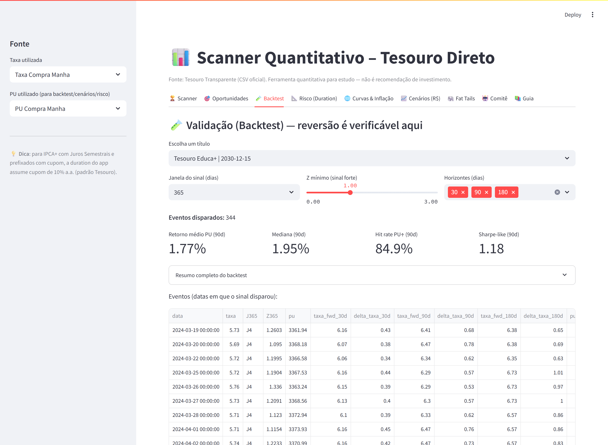
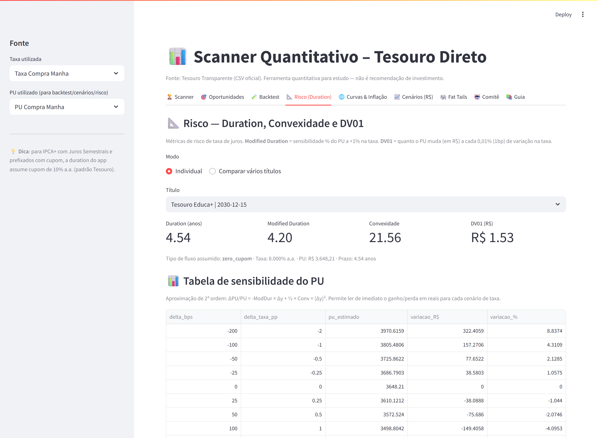
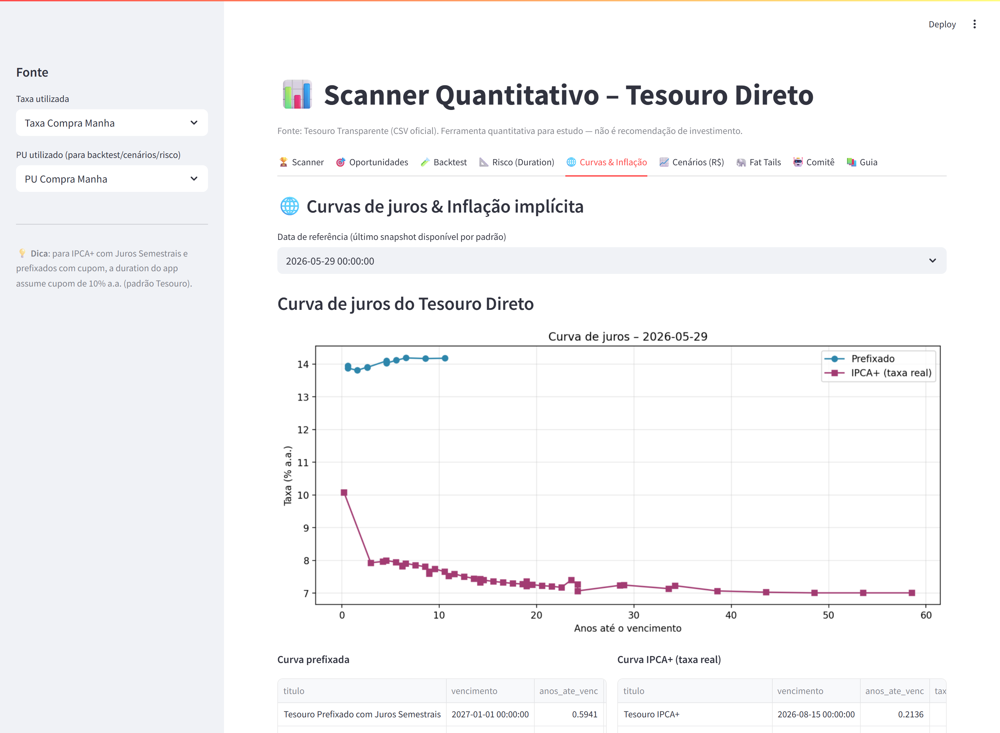
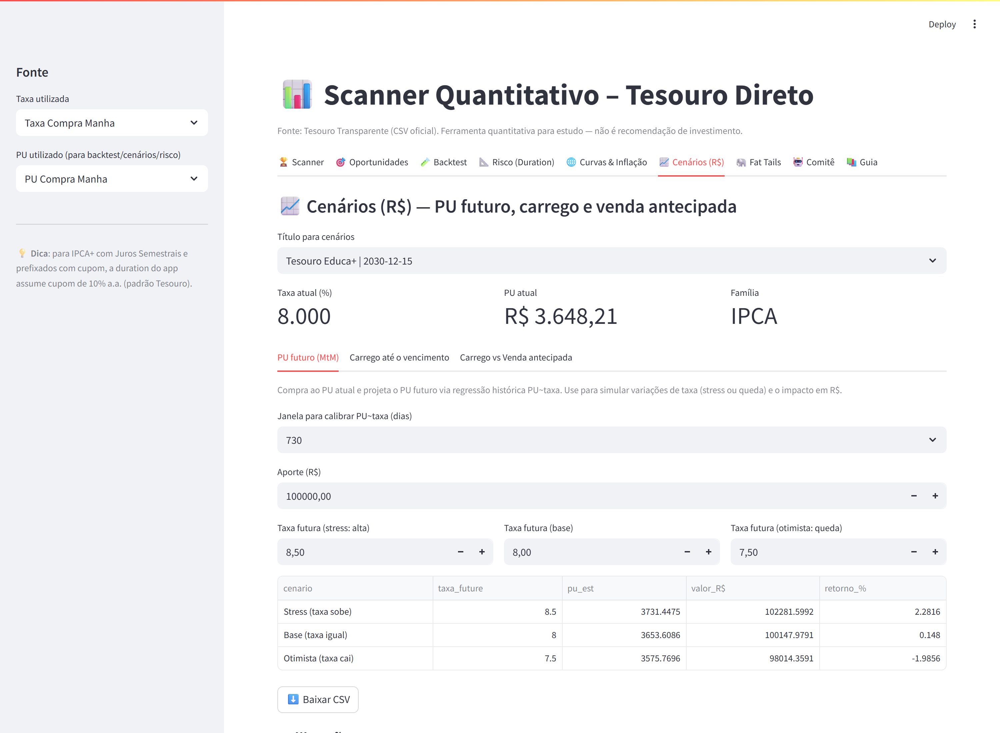
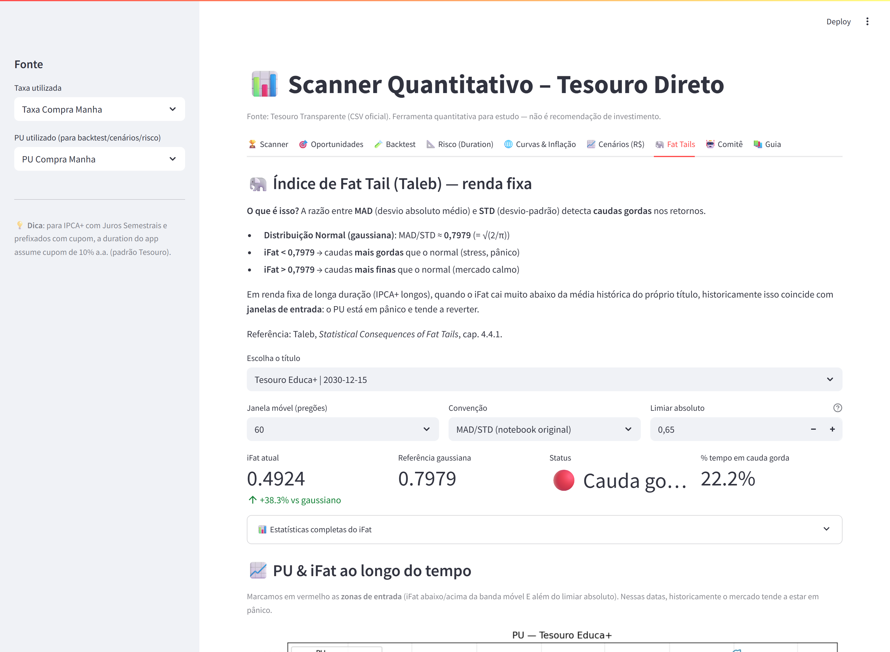
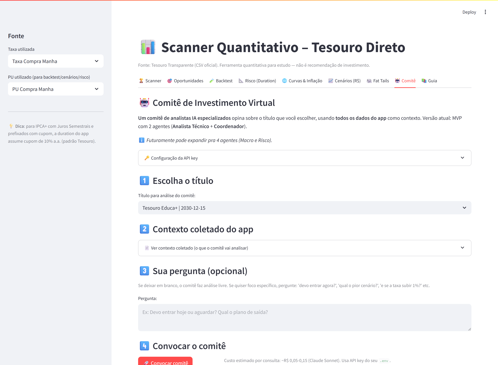
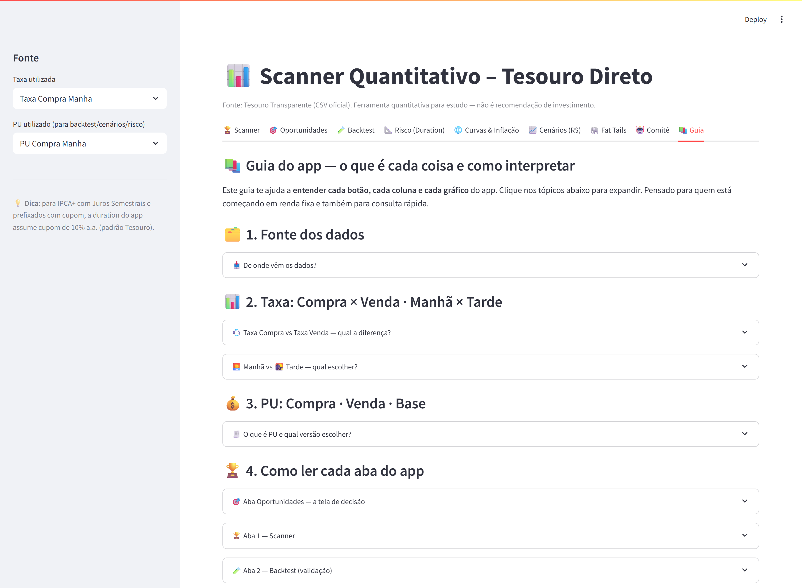

# 📊 Scanner Quantitativo – Tesouro Direto

Aplicação em **Streamlit** para analisar de forma quantitativa os títulos do Tesouro Direto usando o histórico oficial do **Tesouro Transparente** e dados de curva da **ANBIMA**.

O app identifica oportunidades por **quartis de taxa** e **z-score**, permite **validar** a ideia de reversão à média via **backtest**, calcula **métricas de risco de renda fixa** (duration, convexidade, DV01), mostra a **curva de juros** e a **inflação implícita** (pré vs IPCA+), detecta **regimes de cauda gorda** nos retornos do PU (índice Taleb MAD/STD), e simula **cenários em R$** com carrego, DCA, e comparação carrego × venda antecipada.

> ⚠️ **Aviso**: este projeto é uma ferramenta de estudo quantitativo. Não constitui recomendação de investimento.

---

## 🖼️ Telas

| Scanner | Oportunidades | Backtest |
|---|---|---|
|  |  |  |

| Risco (Duration) | Curvas & Inflação | Cenários (R$) |
|---|---|---|
|  |  |  |

| Fat Tails (Taleb) | Comitê (IA) | Guia |
|---|---|---|
|  |  |  |

---

## ✨ Funcionalidades

### 🏆 Aba 1 — Scanner
- Ranking de todos os pares *(título, vencimento)* disponíveis.
- Sinais calculados em múltiplas janelas (180 / 365 / 730 dias):
  - **Quartil (J1–J4)** da taxa atual vs. janela.
  - **Z-score** da taxa atual vs. janela.
- Score composto ponderando janelas + concordância 12m/24m.
- Filtros por família (IPCA+, Prefixado, Educa+, etc.), score mínimo e prazo.
- Export CSV do ranking.

### 🎯 Aba 2 — Oportunidades — **NOVO**
- **Tela-síntese de decisão operacional**: combina histórico do sinal + status atual + veredito automático em uma única tabela.
- Para cada título, mostra: iFat atual, posição-alvo (via sizing escalonado), excesso histórico vs baseline, hit rate e número de eventos.
- **Veredito automático** em 5 níveis: ✅ FORTE / 🟢 OK / 🟡 FRACO / ❌ EVITAR / 📊 SEM DADOS — classificação baseada em critérios objetivos (excesso, hit rate, número de eventos).
- **Seção "Ação recomendada AGORA"**: lista os títulos em zona de entrada ativa com posição sugerida.
- Filtros por veredito, posição mínima e ordenação customizável.

### 🧪 Aba 3 — Validação (Backtest)
- Escolhe um título e dispara sinal quando `J == J4` e `Z ≥ z_min`.
- Mede a mudança de **taxa** e o **retorno do PU** em horizontes futuros (30, 60, 90, 180, 365 dias).
- Métricas em cards: **média, mediana, p25, p75, hit rate, Sharpe-like**.
- Histogramas de retornos com média e zero destacados.
- Export CSV dos eventos.

### 📐 Aba 4 — Risco (Duration) — **NOVO**
- **Duration de Macaulay**, **Modified Duration**, **Convexidade** e **DV01** por título.
- Modelo de fluxo automático:
  - Zero-cupom para LTN / NTN-B Principal / LFT (Selic).
  - Cupom semestral (10% a.a.) para NTN-F e NTN-B com Juros Semestrais.
- **Tabela de sensibilidade do PU** a variações de -200 bps a +200 bps usando aproximação de 2ª ordem (duration + convexidade).
- Modo **comparativo multi-título**: scatter plot Duration × Prazo, bolhas proporcionais ao DV01.

### 🌐 Aba 5 — Curvas & Inflação — **NOVO**
- **Curva de juros** do próprio Tesouro Direto, em cada data de pregão, para **pré** e **IPCA+**.
- **Inflação implícita**: para cada par de vencimentos próximos, calcula `(1+pré)/(1+real) − 1`.
- Decisão central de RF no Brasil: "a inflação que eu espero é maior ou menor que a implícita?".
- **ETTJ ANBIMA** (opcional, via `pyettj`) — busca a curva oficial suavizada via modelo de Svensson.

### 📈 Aba 6 — Cenários (R$)
Sub-abas organizadas:

- **PU futuro (MtM)**: cenário base / stress / otimista via regressão PU~taxa.
- **Carrego até o vencimento (IPCA+)**:
  - Evolução nominal = `(1+real)^t × (1+IPCA)^t`.
  - Custódia anualizada (B3: 0,20% a.a.).
  - **IR regressivo automático** (22,5% / 20% / 17,5% / 15%).
  - **DCA — Aportes periódicos** (mensal ou anual) — **NOVO**.
- **Carrego vs Venda antecipada** — **NOVO**:
  - Simula vender em N anos assumindo uma taxa futura, vs. carregar pelo mesmo período.
  - Mostra qual estratégia ganha e por quanto (líquido de IR e custódia).

### 🐘 Aba 7 — Fat Tails (Taleb) — **NOVO**
- Índice **MAD/STD** em janela móvel sobre os retornos do PU.
- Referência teórica: uma distribuição Gaussiana tem `MAD/STD = √(2/π) ≈ 0,7979`.
- Valores abaixo do gaussiano = caudas mais gordas = regime de stress.
- **Zonas de entrada** automáticas (combinação de limiar absoluto + banda móvel).
- **Backtest da estratégia Fat Tail**: mede o retorno médio após cada sinal, comparando com o baseline (retorno médio sem filtro). Mostra se "comprar em pânico" gerou excesso de retorno historicamente.
- Duas convenções disponíveis: **MAD/STD** (original, Brambilla) e **STD/MAD** (Taleb, *Statistical Consequences of Fat Tails*, cap 4.4.1).
- **Integrado também no Scanner**: é possível filtrar o ranking para mostrar apenas títulos que estão em zona de cauda gorda neste momento.

### 📚 Aba 8 — Guia — **NOVO**
- **Documentação integrada** no próprio app, pensada como guia didático.
- Explica o que é cada **coluna do CSV** (Taxa Compra/Venda × Manhã/Tarde, PU Compra/Venda/Base) e **qual escolher** para cada tipo de análise.
- Detalha **como interpretar cada gráfico** e cada métrica de cada aba.
- **Glossário** rápido dos termos técnicos (Duration, DV01, J4, iFat, VNA, etc.).
- **Fluxo de uso recomendado** passo a passo: do zero até uma decisão de alocação.

### 🤖 Aba 9 — Comitê (IA) — **NOVO**
- **Comitê virtual de analistas IA** (via API da Anthropic, Claude Sonnet 4.5).
- **MVP com 2 agentes**:
  - **Analista Técnico**: avalia sinais quantitativos (J/Z, iFat, duration, backtest) e emite parecer estruturado com score 0-10.
  - **Coordenador (Portfolio Manager)**: sintetiza pareceres e emite decisão executável com ação, sizing, plano de saída e riscos.
- **Contexto 100% baseado nos dados do app** — agentes não inventam números; apenas interpretam os que o próprio scanner/engine calcula.
- Você coloca sua **API key da Anthropic** no `.env` (ou cola diretamente na aba).
- Custo por consulta: ~R$ 0,10-0,20.
- Permite pergunta livre ("devo entrar agora?", "qual o pior cenário?", "e se o IPCA subir 1%?").
- **Extensível**: a arquitetura suporta adicionar Agente Macro e Agente de Risco depois (plano documentado no código).

---

## 🛠️ Stack

- Python 3.10+
- Streamlit, pandas, numpy, matplotlib, requests
- `pyettj` (opcional) para ETTJ ANBIMA

---

## 🚀 Como rodar localmente

```bash
git clone https://github.com/brunoizi/Analise_Titulos_RF.git
cd Analise_Titulos_RF

python -m venv .venv
source .venv/bin/activate        # macOS / Linux
# .venv\Scripts\activate         # Windows

pip install -r requirements.txt
streamlit run app.py
```

O app abrirá em `http://localhost:8501`.

### 🔑 Opcional — aba Comitê (IA)

A aba 9 (Comitê) usa a API da Anthropic. Para habilitá-la:

```bash
cp .env.example .env          # Windows: copy .env.example .env
# edite o .env e cole sua chave: ANTHROPIC_API_KEY=sk-ant-...
```

O `.env` está no `.gitignore` e **nunca** deve ser commitado. Sem a chave, todas as outras abas funcionam normalmente.

---

## ☁️ Publicar no Streamlit Community Cloud

1. Suba este repositório para o GitHub (público).
2. Vá em [share.streamlit.io](https://share.streamlit.io) e conecte sua conta.
3. **New app** → selecione repositório, branch `main`, arquivo `app.py`.
4. Deploy. O Streamlit lê o `requirements.txt` automaticamente.

Se o `pyettj` falhar em alguma versão do ambiente, o app continua funcionando — a integração ANBIMA é opcional e tem fallback silencioso.

---

## 📁 Estrutura

```
Analise_Titulos_RF/
├── app.py                      # Interface Streamlit (9 abas)
├── engine.py                   # Lógica quantitativa
├── agents/                     # Comitê de IA (aba 9)
│   ├── __init__.py
│   ├── base.py                 # Classe base do agente (Anthropic)
│   ├── technical.py            # Analista Técnico
│   ├── coordinator.py          # Coordenador / Portfolio Manager
│   └── orchestrator.py         # Monta contexto e roda o comitê
├── validacao_fat_tail.ipynb    # Notebook de validação empírica
├── test_agents.py              # Teste rápido dos agentes
├── docs/
│   └── FAT_TAILS.md            # Guia do notebook Fat Tail
├── requirements.txt
├── .env.example                # Modelo do .env (sem chaves)
├── .gitignore
├── LICENSE
└── README.md
```

---

## 📐 Metodologia resumida

### Quartis (J) e Z-score
Para cada janela `w`, calcula os quartis e a média/desvio da taxa do próprio título nos últimos `w` dias. A taxa atual cai em J1 (baixa), J2, J3 ou J4 (alta). `Z = (taxa − média) / desvio`.

### Score
```
score = 2·pts(J730) + 1·pts(J365) + 1.5·Z730 + 0.8·Z365 + 0.5·(J365==J730)
pts(J1)=0, pts(J2)=1, pts(J3)=2, pts(J4)=3
```

### Duration e convexidade
Zero-cupom: fórmula fechada. Cupom semestral: desconta o fluxo assumindo cupom de 10% a.a. (padrão Tesouro).

```
Duration Macaulay  = Σ (t · PV(t)) / PV_total
Modified Duration  = Duration / (1 + y)
Convexidade        = Σ (t·(t+1) · PV(t)) / PV_total / (1+y)²
DV01               = PU · MD · 0.0001
ΔPU/PU             ≈ -MD·Δy + ½·Conv·(Δy)²
```

### Inflação implícita
```
inflação_implícita = (1 + taxa_pré) / (1 + taxa_real) − 1
```

### Índice Fat Tail (Taleb, cap 4.4.1)
Em janela móvel sobre os retornos do PU:
```
MAD   = (1/n) Σ |r_i − mean(r)|
STD   = sqrt((1/n) Σ (r_i − mean(r))²)
iFat  = MAD / STD          (convenção notebook)
iFat  = STD / MAD          (convenção Taleb)
```
Para distribuição Normal: `MAD/STD ≈ 0,7979` e `STD/MAD ≈ 1,2533`.
Valores muito distantes desse "âncora gaussiano" indicam regime de cauda gorda — úteis para detectar momentos de pânico que historicamente coincidem com oportunidades de entrada em renda fixa longa.

### Hipótese de reversão
Após sinal forte (J4 + Z alto), a taxa tende a cair e o PU a subir. O backtest mede isso diretamente nos dados históricos.

---

## 📚 Fontes

- [Tesouro Transparente – Preço e Taxa](https://www.tesourotransparente.gov.br/ckan/dataset/taxas-dos-titulos-ofertados-pelo-tesouro-direto)
- [ANBIMA – ETTJ estimada](https://www.anbima.com.br/informacoes/est-termo/CZ.asp)
- [pyettj (biblioteca Python)](https://github.com/rafa-rod/pyettj)

---

## 🗺️ Roadmap futuro

- Comparação com benchmarks (CDI/Selic/IMA-B)
- Regime-switching nos sinais J/Z
- Monte Carlo para probabilidade de atingir metas
- Otimização de carteira (Markowitz adaptado)

---

## 📝 Licença

MIT
